## FluidVSR Project Usage

这是 `SDIFT` 在本项目里的本地适配说明。下面原始 upstream README 仍然保留；如果你只是想复现本项目实验，请优先看这一节。

需要强调一点：这里已经不是原始“稀疏不规则观测重建”任务，而是针对本项目的**配对超分任务**做过修改的版本。

### 当前用途

本地可直接运行的脚本主要覆盖：

- `RBC ×4`
- `SW ×4`
- `KF256 ×4`

本仓库当前没有整理成正式入口的 `ERA5` 训练/推理脚本。

### 三阶段流程

当前版本仍然保留三阶段思路：

1. `FTM`
   学习 Tucker / basis 表示。
2. `GPSD`
   在 core 序列上训练扩散模型。
3. `Inference`
   用后验采样恢复 HR 序列，并导出统一格式预测。

### 关键文件

- `train_FTM_RB.py`
- `train_FTM_SW.py`
- `train_FTM_KF256.py`
- `train_GPSD_RB.py`
- `train_GPSD_SW.py`
- `train_GPSD_KF256.py`
- `inference_RB.py`
- `inference_SW.py`
- `inference_KF256.py`
- `inference_paired_sr_generic.py`
- `sr_posterior_utils.py`
- `efficiency_tracker.py`

### 当前版本与原始任务的关键差别

当前超分版本的核心修改是：

- 观测不再是随机稀疏点，而是**配对的 LR 帧**
- 后验监督不再基于“抽点观测”，而是基于**HR 解码后再做 bilinear 下采样，与 LR 对齐比较**

也就是说，这里的 posterior guidance 已经是为配对超分任务改过的，不要再按原始 SDIFT 论文的“随机点观测”理解。

### Stage 1: FTM

`RBC`：

```bash
cd /data/yc/FluidVSR/SDIFT-main
python train_FTM_RB.py
```

`SW`：

```bash
cd /data/yc/FluidVSR/SDIFT-main
python train_FTM_SW.py
```

`KF256`：

```bash
cd /data/yc/FluidVSR/SDIFT-main
python train_FTM_KF256.py
```

### Stage 2: GPSD

`RBC`：

```bash
cd /data/yc/FluidVSR/SDIFT-main
python train_GPSD_RB.py --core_path data/core_rb_*.mat
```

`SW`：

```bash
cd /data/yc/FluidVSR/SDIFT-main
python train_GPSD_SW.py --core_path data/core_sw_*.mat
```

`KF256`：

```bash
cd /data/yc/FluidVSR/SDIFT-main
python train_GPSD_KF256.py --core_path data/core_kf256_*.mat
```

### Stage 3: Inference

`RBC`：

```bash
cd /data/yc/FluidVSR/SDIFT-main
python inference_RB.py \
  --basis_path ckp/basis_rb_*.pth \
  --model_path exps/gp-edm_rb_*/checkpoints/ema_*.pth \
  --core_mean_std_path exps/gp-edm_rb_*/core_mean_std.mat \
  --norm_stats_path data/norm_stats_rb_*.json \
  --output_dir output_rb
```

`SW`：

```bash
cd /data/yc/FluidVSR/SDIFT-main
python inference_SW.py \
  --basis_path ckp/basis_sw_*.pth \
  --model_path exps/gp-edm_sw_*/checkpoints/ema_*.pth \
  --core_mean_std_path exps/gp-edm_sw_*/core_mean_std.mat \
  --norm_stats_path data/norm_stats_sw_*.json \
  --output_dir output_sw
```

`KF256`：

```bash
cd /data/yc/FluidVSR/SDIFT-main
python inference_KF256.py \
  --basis_path ckp/basis_kf256_*.pth \
  --model_path exps/gp-edm_kf256_*/checkpoints/ema_*.pth \
  --core_mean_std_path exps/gp-edm_kf256_*/core_mean_std.mat \
  --norm_stats_path data/norm_stats_kf256_*.json \
  --output_dir output_kf256
```

### 输出格式

输出目录通常是：

- `output_rb/`
- `output_sw/`
- `output_kf256/`

其中会包含：

- `pred.npz`
- `gt.npz`
- `lr.npz`
- `meta.json`

### 统一评估

导出预测后，统一回到：

- `/data/yc/FluidVSR/Fluid_VSR/template_notebook/`
- `/data/yc/FluidVSR/Fluid_VSR/tools/`

进行指标和可视化统计。

---

#  Generating Full-field Evolution of Physical Dynamics from Irregular Sparse Observations [NeurIPS2025]
<div align=center>  </div>
(This repo is still on update)
 


This is authors' official PyTorch implementation for paper:"**Generating Full-field Evolution of Physical Dynamics from Irregular Sparse Observations**"[[Openreview](https://openreview.net/forum?id=5d83SyLm0Z)][[Arxiv](https://arxiv.org/pdf/2505.09284)].


***Our paper has been accepted by NeurIPS 2025!*** 🎉🎉


---
## Key Idea
Generating ***Continous Spatiotemporal Multidimensional Physical Data*** with Functional Tucker Model, GP-based Sequential Diffusion and Message-Passing Posterior Sampling.


<!-- <!-- <div align=center>  </div> -->

<div align=center> 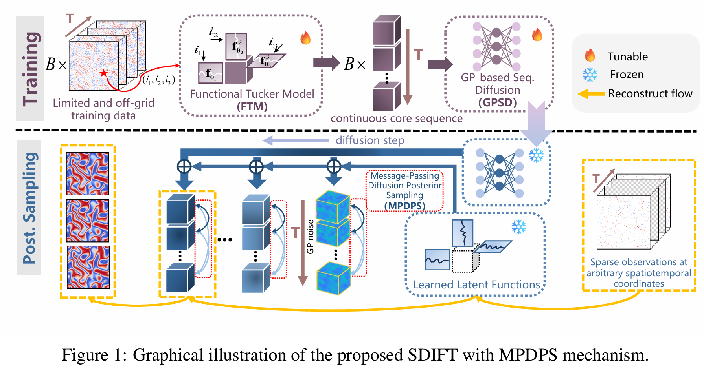 </div>

### Functional Tucker Model (FTM)
<div align=center> 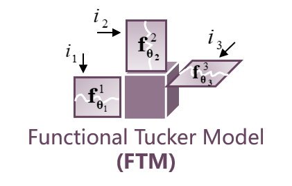 </div>
FTM is a general framework that naturally captures the inherent multi-dimensional structure 
of physical fields and provides compact representations well-suited for sparse or irregular 
scenarios. 


### Gaussion Process-based Sequential Diffusion  (GPSD)
<div align=center> 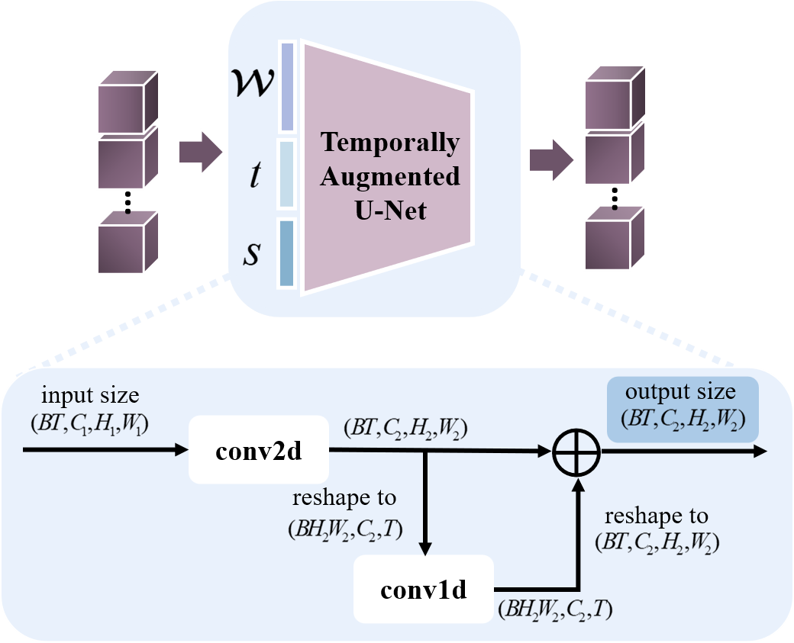 </div>

GPSD is a variant of diffusion models that uses a Gaussian Process (GP) as the noise source to better capture temporal continuity. Specifically, we design a new architecture called the **Temporally-Augmented U-Net** to serve as the denoiser. 


### Message-Passing Diffusion Posterior Sampling (MPDPS)
<div align=center> 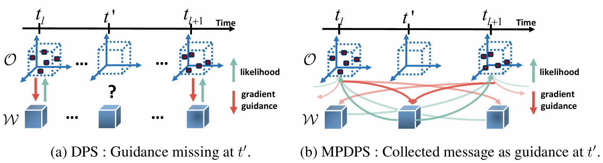 </div>

MPDPS **leverages the temporal continuity inherent in physical dynamics and propagates observation-derived guidance across the entire core sequence** using Gaussian Process Regression (GPR). For cores at timesteps with direct observations, this guidance is further refined through messages from neighboring observed timesteps. This smoothing mechanism enhances the robustness of the generated sequence, especially under noisy or extremely sparse observations.


---

## Quick Snapshot of Reconstruction Results on Acttive Matter dataset: 

### Ground Truth:
<div align=center>
  
</div>


### Sampling Pattern for Observation Setting 1 (Consistently 1% Observation Rate across All Timesteps):
<div align=center> 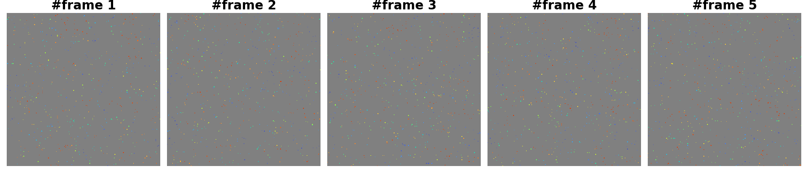 </div>


#### Reconstruction Results on Observation Setting 1
<table>
<tr>
  <td align="center">
    <br>
    <sub>A:SDIFT + MPDPS (clean observation)</sub>
  </td>
  <td align="center">
    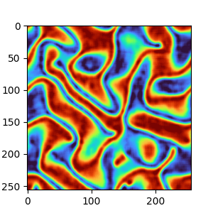<br>
    <sub>B:SDIFT + DPS (clean observation)</sub>
  </td>
  <td align="center">
    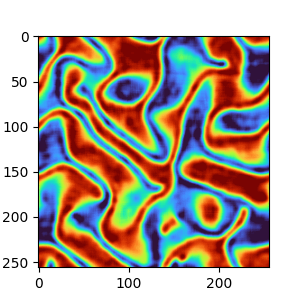<br>
    <sub>C:SDIFT + MPDPS (noisy observation)</sub>
  </td>
  <td align="center">
    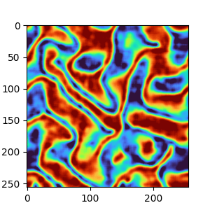<br>
    <sub>D:SDIFT + DPS (noisy observation)</sub>
  </td>
</tr>
</table>
Animations A and B show SDIFT with MPDPS and DPS reconstructions, respectively, using clean observations.
Animations C and D present the same reconstructions under severe noise conditions.

- All cases demonstrate the ability to reconstruct the approximate structure of the physical field from highly sparse observations, thanks to the FTM encoder, which significantly reduces the number of unknown variables (i.e., the elements of the core tensor).
- One can see that our proposed MPDPS ***significantly improves both qualitative and quantitative reconstruction results—the evolution of the physical field is much smoother—and demonstrates strong robustness against noise.***


### Sampling Pattern for Observation Setting 2  (1% Observation Rate across Interlaced Timesteps):
<div align=center> 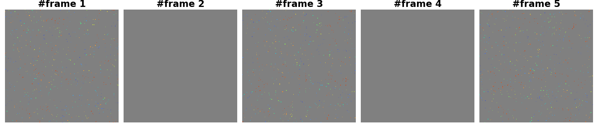 </div>


#### Reconstruction Results on Observation Setting 2


<table align="center">
  <tr>
    <td align="center">
      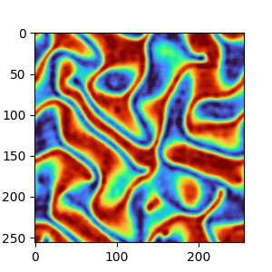<br>
      A:SDIFT + MPDPS (clean observation)
    </td>
    <td align="center">
      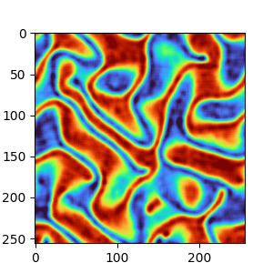<br>
      B:SDIFT + DPS (clean observation)
    </td>
  </tr>
</table>

It is obvious that, unlike DPS which generates non-smooth animations, ***MPDPS consistently produces accurate and smooth reconstructions, even at timesteps lacking direct observations***, demostrating the effectivenness of our proposed method.


------------------

<!-- Example of latent functions of spatial and temporal modes learned from real-world data.
<div align=center>  </div>
<div align=center>  </div> -->

## Requirements:
The project is mainly built with **pytorch 2.3.0** under **python 3.10**. The detailed package info can be found in `requirement.txt`.

## Instructions:
1. Clone this repository.
2. **To play with the model quickly on MPDPS, we provide a Jupyter notebook at `notebook/demo_fast_test_active_matter.ipynb`, demonstrated on the Active Matter dataset.**
3. If you want to customize the project for your own data, please run the Python scripts in the following order:

- **`train_FTM.py`**  
  Trains the Functional Tucker Model using physical data and outputs shared latent functions along with batches of core tensors.

- **`train_GPSD.py`**  
  Trains the GP-based Sequential Diffusion Model using the batches of core tensors obtained from the first step.

- **`message_passing_DPS.py`**  
  Reconstructs the entire field from sparse observations using our proposed Message-Passing DPS algorithm.


4. Tune the (hyper)parameters of model in the corresponding `.py` file.
5. To apply the model on your own dataset, please follow the  `preprocessing_data.py` file to process the raw data into appropriate format.
6. GPU choice: the models are run on CPU by default, but you can change the device to CPU by modifying the `device` in the correponding file.


 ## Data Preparation

We offer the **raw data** for all three datasets used in paper. 

- Supernova Explosion: [raw data](https://polymathic-ai.org/the_well/datasets/supernova_explosion_64/)

- Ocean Sound Speed: [raw data](https://ncss.hycom.org/thredds/catalog.html)

- Active Matter: [raw data](https://polymathic-ai.org/the_well/datasets/active_matter/)


## Citing SDIFT
> 🌟 If you find this resource helpful, please consider to star this repository and cite our research:
```tex
@inproceedings{
chen2025generating,
title={Generating Full-field Evolution of Physical Dynamics from Irregular Sparse Observations},
author={Panqi Chen and Yifan Sun and Lei Cheng and Yang Yang and Weichang Li and Yang Liu and Weiqing Liu and Jiang Bian and Shikai Fang},
booktitle={The Thirty-ninth Annual Conference on Neural Information Processing Systems},
year={2025},
url={https://openreview.net/forum?id=5d83SyLm0Z}
}
```
In case of any questions, bugs, suggestions or improvements, please feel free to open an issue.
